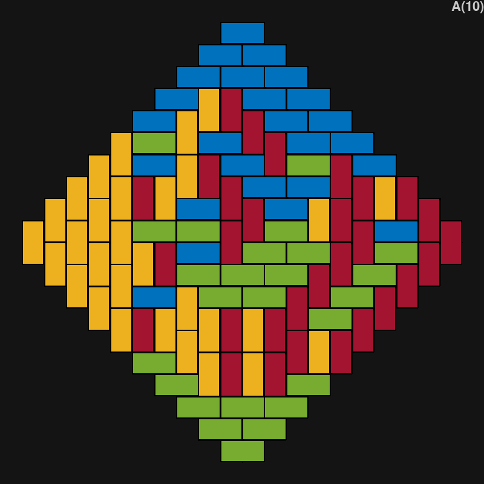
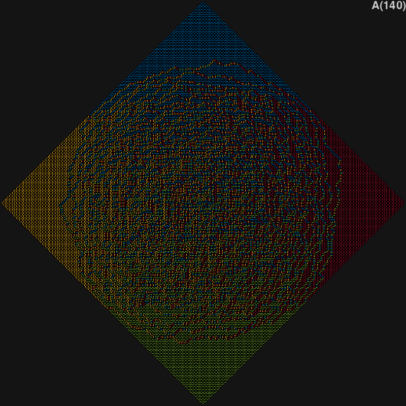

# AztecDiamonds

Inspired by Mathologer's video on generating random tilings of Aztec Diamonds 
(https://www.youtube.com/watch?v=Yy7Q8IWNfHM) 
I decided to try and impliment and animate the algorithm.

The script "main.py" continuously steps through the tiling actions and draws each change. 
It is capped at 4 fps for visibility (adjustable by input parameter), 
but will begin to bog down as the diamond size increases.

